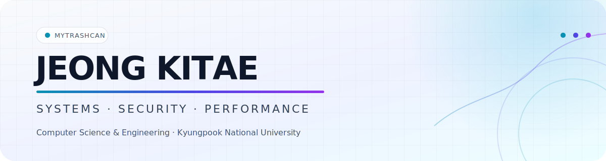

<picture>
  <source media="(prefers-color-scheme: dark)" srcset="./assets/profile-header-dark.svg" />
  <source media="(prefers-color-scheme: light)" srcset="./assets/profile-header-light.svg" />
  
</picture>

  
  
  

## About

I am a Computer Science & Engineering student at **Kyungpook National University**. I like software that is measurable, explainable, and dependable—from runtime internals and security boundaries to distributed delivery and production operations.

- **Systems** — low-latency paths, runtime internals, and performance-aware design
- **Security** — application security, reverse engineering, and responsible disclosure
- **Operations** — observable services, defensive defaults, and cloud deployment

## Selected work

<table>
  <tr>
    <td width="50%" valign="top">
      <h3><a href="https://github.com/mytrashcan/OpenStreamGrid">OpenStreamGrid</a></h3>
      
Hybrid P2P-CDN middleware for MPEG-TS HLS, with verified segment delivery and immediate origin fallback.

      
<code>TypeScript</code> <code>Node.js</code> <code>WebRTC</code> <code>MPEG-TS HLS</code>

    </td>
    <td width="50%" valign="top">
      <h3><a href="https://github.com/mytrashcan/MarketGuard">MarketGuard</a></h3>
      
Explainable, rule-based anomaly monitoring over public market data, built around a framework-independent detection core.

      
<code>Java</code> <code>Spring Boot</code> <code>PostgreSQL</code> <code>Docker</code>

    </td>
  </tr>
  <tr>
    <td width="50%" valign="top">
      <h3><a href="https://github.com/mytrashcan/gallery-image-relay">Gallery Image Relay</a></h3>
      
Multi-platform image relay with moderation windows, deduplication, and an ephemeral RAM-only web gallery.

      
<code>Python</code> <code>FastAPI</code> <code>Discord</code> <code>Telegram</code>

    </td>
    <td width="50%" valign="top">
      <h3><a href="https://github.com/mytrashcan/sbox-dumper">sbox-dumper</a></h3>
      
Single-pass .NET runtime inspector that extracts managed offsets, player data, and component references with ClrMD.

      
<code>C#</code> <code>.NET 8</code> <code>ClrMD</code> <code>Runtime Analysis</code>

    </td>
  </tr>
</table>

## Toolbox

  
  
  
  
  

  
  
  
  
  
  

### AI-assisted development

  
  
  
  

I use coding agents as engineering tools: to investigate real code paths, tighten feedback loops, and turn decisions into tested changes.

## Credentials

Google AI Essentials · Information Processing Craftsman · ITQ OA Master · TOEIC 900

## Learning loop
